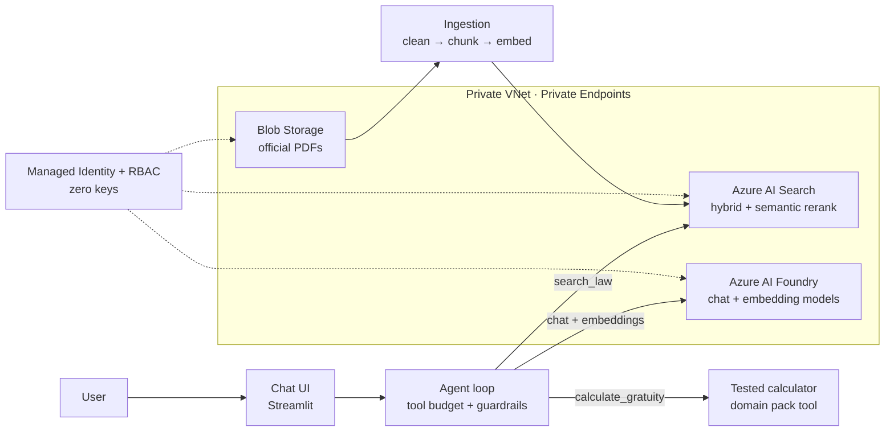

# UAE Labour Law AI Agent

Ask about your rights at work in plain language. Get answers grounded in the official law, with the exact page cited, and amounts calculated by tested code.

Built as a **reusable, secure agent framework** that deploys into any Azure tenant.

> 🎥 **Demo:** _link to video_
>
> ⚠️ Independent learning project on public law. General information, not legal advice. Not affiliated with any government entity. The Arabic text of the law is authoritative.

---

## Why

Most people never read their labour law. It's long, legal, and hard to follow.
This agent reads the law for you and explains it naturally.

## What it does

- Answers questions on gratuity, annual leave, passports, contracts
- Searches the official UAE labour law (Decree-Law 33/2021 + Executive Regulation)
- Cites the source page for every legal statement
- Calculates amounts with deterministic, unit-tested code
- Asks for missing details instead of guessing

## Architecture



## Engineering highlights

| Area | Approach |
|---|---|
| **Chunking** | Extraction coverage measured per article. Page-aware chunks carry article numbers as metadata; repeated headers, ligatures, and TOC pages handled automatically. Strategy is configurable per domain pack. |
| **Retrieval** | Hybrid search (BM25 + vectors) + semantic reranking + a domain glossary that maps everyday words ("gratuity") to legal terms ("end of service benefits"). |
| **Rate limits & cost** | Output token caps, TPM sized for multi-step agents, retries with backoff, per-tool budgets, max-step brake. |
| **Guardrails** | Numeric grounding: every amount must come from the user or a tool result, or the answer is rejected. Leaked tool-call syntax is rejected. Content filters on every model call. |
| **Security** | Private endpoints for model, search, and storage. Keyless everywhere (managed identity + RBAC). Public access verified blocked (403 with a valid token). Admin jumpbox with no public IP. |
| **Infrastructure as code** | Everything in Bicep: modules for network, AI, DNS, private endpoints, storage, search, identity, lock. `what-if` before every change. |
| **Reusable framework** | Platform + runtime are generic; each use case is a **domain pack** (documents, prompt, tools,

## Deploy it in your own Azure tenant

📘 **Full step-by-step guide: [GETTING_STARTED.md](GETTING_STARTED.md)**

Quick version:
```bash
az login && az account set --subscription <your-subscription-id>
./scripts/bootstrap.sh
cp infra/params/sample.dev.bicepparam infra/params/my.dev.bicepparam   # edit values
export MIZAN_DEV_IP=$(curl -s https://api.ipify.org)
export MIZAN_USER_OBJECT_ID=$(az ad signed-in-user show --query id -o tsv)
az deployment sub create --name foundation --location <region> --parameters infra/params/my.dev.bicepparam
python3 -m venv .venv && source .venv/bin/activate && pip install -r src/requirements.lock
./scripts/write-env.sh foundation uae-labour-law
# upload docs → create_index.py → ingest.py → streamlit run app.py (see guide)
```

## Add a new domain pack

1. Create `packs/<your-pack>/` with `docs/`, `pack.json`, `prompt.md`, and optionally `tools.py` and `evals/`
2. `./scripts/write-env.sh foundation <your-pack>`
3. Upload docs → `python ingest.py --dry-run` → `python ingest.py`

The platform and runtime don't change.

## Roadmap

- 🎙️ Voice in Arabic, Hindi, Malayalam, Urdu
- 📄 Upload a contract or offer letter → clause-by-clause explanation
- 🇮🇳 India pack: labour codes, gratuity act, EPF
- 📦 Shipping documents: flag mismatches in invoices and bills of lading
- 🛃 Customs HS code helper
- 💬 WhatsApp channel
- 🧩 Per-article parsing with a layout-aware model
- 📊 Evaluation dashboard (retrieval hit rate, groundedness)

## Known limitations

- English texts are translations; the Arabic text is authoritative
- Chunks are page-based; some pages mix several articles
- Daily wage assumes monthly basic ÷ 30
- Covers full-time private-sector workers only

## License

**All rights reserved.** Published for demonstration and portfolio purposes. See [LICENSE](LICENSE).
For licensing or deployment in your organisation, contact the author via LinkedIn.

## Disclaimer

General information only, not legal advice. Always confirm with the relevant authority.
